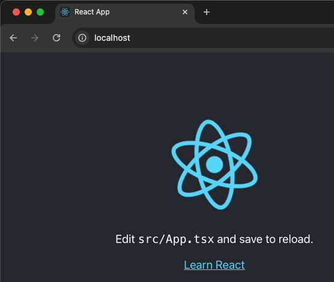

# Containerize a React Application
## Steps
- Create a new TypeScript app named `react-ui` using the provided TypeScript template by appending `--template typescript` to the creation command
```
npx create-react-app react-ui --template typescript
```
This will create a directory called `react-ui` in the current folder with an initial project structure
- Navigate inside the folder
```
cd react-ui
```
- To test the application, run `npm start`

- Containerize the App: Inside the app directory `react-ui`, create a new file named `Dockerfile` and add the following code
```
FROM node:20-alpine as build
WORKDIR /app
ENV PATH /app/node_modules/.bin:$PATH
COPY ./package*.json /app/
RUN npm install
COPY . /app
RUN npm run build

EXPOSE 3000

CMD ["npm", "start"]
```
`npm install` ensures that all dependencies are installed in the container runtime
- Add a `.dockerignore` file in the same directory and add `node_modules` in its content so that Docker will ignore this directory when running the commands.
- Build and Tag the Image: From the root directory, run the following command to build and tag the image
`docker build -f Dockerfile -t react-ui:latest .`
- Test Run the Application: Run the container using the following command
`docker run -it -p 80:3000 --rm react-ui:latest`
You can use any port when running the container to route to the exposed port `3000`. You can then use this same port when testing the application in a web browser `http://localhost:80`
