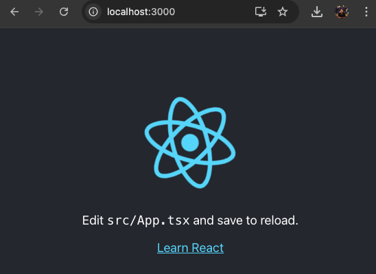

# Containerize a React Application
## Steps
- Create a new TypeScript app named `react-ui` using the provided TypeScript template by appending `--template typescript` to the creation command
```
npx create-react-app react-ui --template typescript
```
This will create a directory called `react-ui` in the current folder with an initial project structure
- Navigate inside the folder
```
cd react-ui
```
- To test the application, run `npm start`
